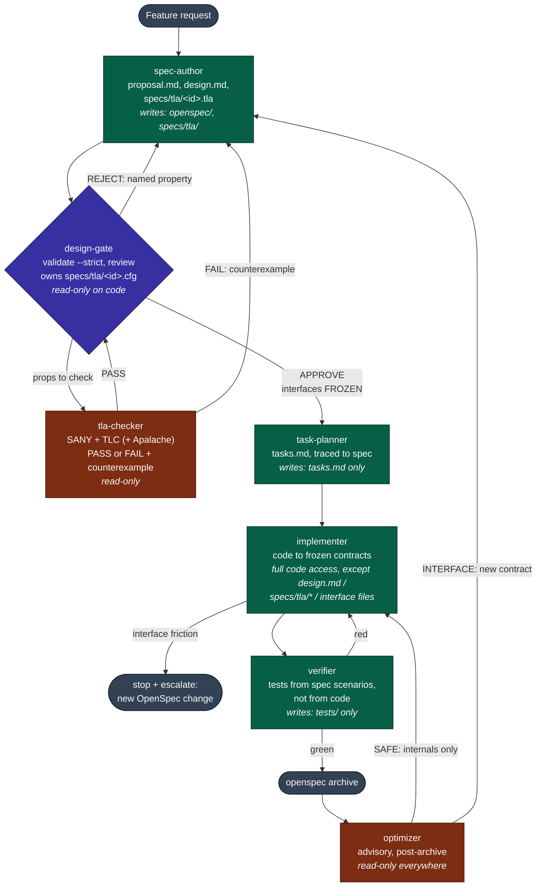

# Design: spec-driven-tla sub-agent pipeline

Seven role-scoped sub-agents carry one OpenSpec change from request to
archive. The main session is the **orchestrator**: it routes work between
agents, enforces phase gates, and never writes specs or code itself.

## Pipeline diagram

Color key: green = write access to its own artifacts, indigo = the gate
(read-only code, owns `.cfg`), brown = read-only report-only agents, gray =
pipeline endpoints.

## Agent roles and write boundaries

| Agent | Writes | Reads | Never touches |
|---|---|---|---|
| `spec-author` | `openspec/changes/<id>/{proposal,design,specs/*}.md`, `specs/tla/<id>.tla` | existing specs | source, tests |
| `design-gate` | `specs/tla/<id>.cfg` only | everything | proposal.md, design.md, `.tla`, source |
| `tla-checker` | nothing | `.tla`, `.cfg` | anything (report-only) |
| `task-planner` | `tasks.md` | proposal, spec deltas, design.md | design.md, `.tla`/`.cfg`, source |
| `implementer` | source code | design.md, tasks.md | design.md, `specs/tla/*`, interface files |
| `verifier` | `tests/*` | spec scenarios, design.md (not the implementation) | source, design.md, `.tla`/`.cfg` |
| `optimizer` | nothing | archived change, code | anything (report-only) |

## The two hard rules

1. **Frozen interfaces.** Once `design-gate` approves, every signature, error
   contract, and spec scenario in `design.md` is FROZEN. No downstream agent
   may alter one in place. A needed change goes through a **new** OpenSpec
   proposal. No exceptions.
2. **Revise loop.** A `design-gate` REJECT names a violated property; the
   `tla-checker` re-runs TLC on the revised model, returning either a
   **counterexample** (the `spec-author` revises the `.tla` model, not a
   prose argument) or **evidence the objection does not hold** (returned to
   the gate). The gate re-reviews only models that PASS.

## Why the design gate is formal, not just a review

A prose review catches what the reviewer thinks to check. Turning every
formalizable objection into a TLA+ `INVARIANT` or `PROPERTY` makes it
checkable by TLC against the full reachable state space (within stated
bounds) — see [TLA+](tla-plus.md). This is the seam that separates this
workflow from a plain OpenSpec review: **implementation is gated on a model
that was checked, not just a design that was read.**

## See also

- [TLA+](tla-plus.md) — what it models, TLC, why bounds matter.
- [OpenSpec](openspec.md) — phases, workspace layout, key commands.
- [`skills/spec-driven-tla`](../skills/spec-driven-tla) — the installable
  skill and its agent templates.
