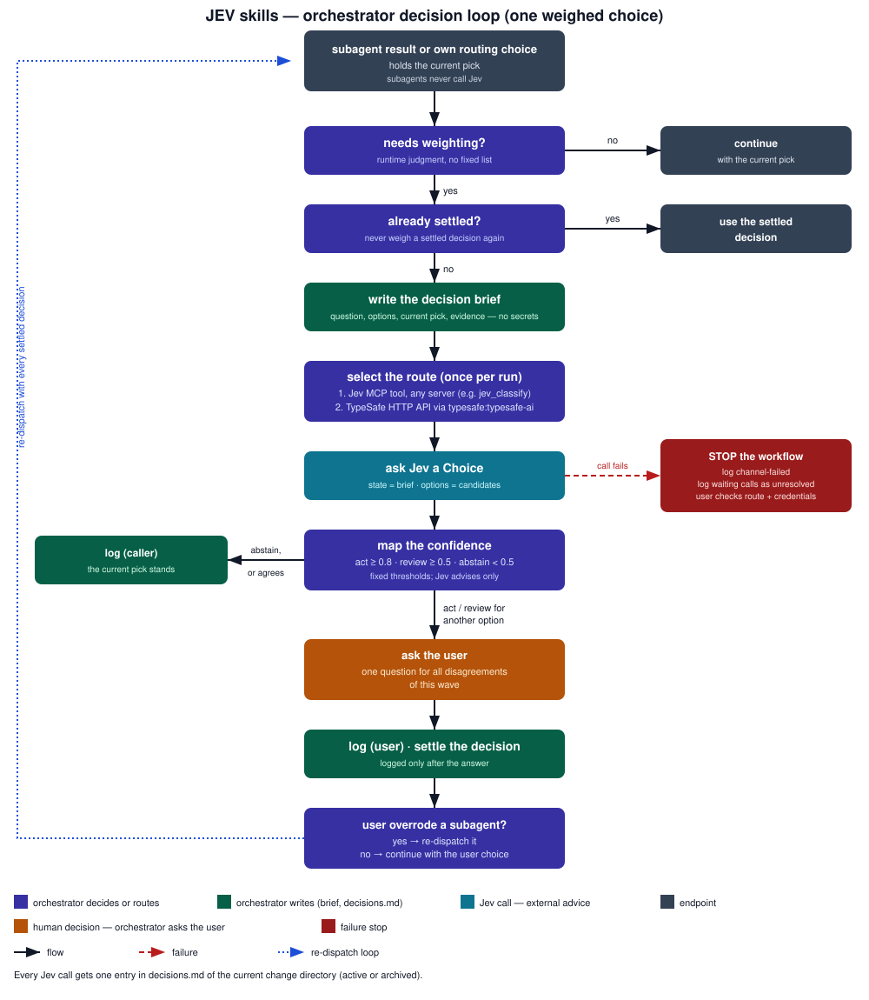

# spec-driven-tla-parallel-jev

Skill: [`skills/spec-driven-tla-parallel-jev`](../skills/spec-driven-tla-parallel-jev).
This skill adds Jev advice to [spec-driven-tla-parallel](spec-driven-tla-parallel.md).
Jev is the TypeSafe judgment model.
The skill is a `SKILL.md` file only.

The base skill owns the installer, the eight sub-agents, the phase gates, and the batch loop.
This skill changes none of them.
The main session is the **orchestrator**.
The orchestrator is the only caller of Jev and the only writer of the decision log.
The `implementation-orchestrator` is a sub-agent, so it never calls Jev.

## What is different from spec-driven-tla-parallel

- **Step 0** checks for a Jev route before the base install.
  A route is a Jev MCP (Model Context Protocol) tool from any server, or the skill `typesafe:typesafe-ai`.
  With no route, the skill stops and shows the TypeSafe plugin install commands.
- **Step 1** runs the base installer without change: `install.sh` on macOS and Linux, `install.ps1` on Windows.
  The installed agents and their tool permissions do not change.
- **Step 2** runs the base workflow.
  The orchestrator weighs returned decisions with Jev when it judges that a choice needs weighting.
  It follows the [shared Jev protocol](../skills/_shared/jev-protocol.md).

## Pipeline diagram

The pipeline is the base pipeline.

The orchestrator weighs by runtime judgment, not from a fixed list.
This table shows typical weighing points:

| Point in the pipeline | Current pick | Options Jev weighs |
|---|---|---|
| `design-gate` verdict | the gate verdict | APPROVE, REJECT |
| `implementation-orchestrator` Plan | the proposed batch | run the batch, split the batch |
| `implementer` group stop | the stop reason | safe fix, re-scope the groups, new OpenSpec change |
| `implementation-orchestrator` Integrate conflict | the conflict report | re-scope the groups, retry the merge |
| `verifier` report | the verifier claim | tests match the spec, tests mirror the implementation |
| `optimizer` proposal | the proposal tag | SAFE, INTERFACE |

The two human checkpoints stay user decisions.
The orchestrator does not weigh them with Jev.

## Decision loop

Each weighed choice runs this loop:

Color key: indigo = the orchestrator decides or routes, green = the orchestrator writes, teal = the Jev call, amber = the user decides, red = failure stop, gray = endpoints.
Solid black = flow, dashed red = failure, dotted blue = re-dispatch loop.

## Parallel waves

Concurrent implementers return their results in one wave.
The orchestrator weighs the returned decisions of the wave.
It collects every disagreement of the wave into one user question.
It logs each call once, before it re-dispatches, integrates, or stops.
It re-dispatches an overridden group with every settled decision of that group.

## Rules

1. **Jev advises.** The current pick stands unless the user overrides it.
2. **Fixed thresholds.** The orchestrator maps the Choice confidence to `act` (0.8 or more), `review` (0.5 or more), or `abstain` (below 0.5).
3. **Escalation.** When Jev picks another option with `act` or `review`, the orchestrator asks the user.
   On `abstain`, the current pick stands.
4. **One route per run.** The orchestrator prefers a Jev MCP tool, for example mcpflow `jev_classify`.
   Without one, it uses the TypeSafe HTTP API through `typesafe:typesafe-ai`.
   For several independent choices over the same state, it can use a batch tool such as mcpflow `jev_ask`.
5. **Settled decisions.** The orchestrator passes every settled decision to later dispatches.
   It never weighs a settled decision again.
6. **Decision log.** The orchestrator appends one entry per Jev call to `decisions.md` in the current change directory.
   After `openspec archive`, the log moves with the change, and the orchestrator appends to the archived log.
   It logs an escalated call only after the user answers, or as `unresolved` when the workflow stops first.
7. **Failure stop.** A failed Jev call stops the workflow.
   The orchestrator logs the failure and tells the user to check the route and its credentials.
8. **No secrets.** Briefs and log entries never contain credentials, tokens, or environment-file contents.

## Platforms

The skill runs on macOS, Linux, and Windows.
It adds no scripts.
The base skill supplies the installer for each platform.

## Design record

The OpenSpec change [`add-jev-decision-advice`](../openspec/changes/add-jev-decision-advice) records the design, the TLA+ (Temporal Logic of Actions) model of the earlier protocol, and the review findings.

## See also

- [spec-driven-tla-parallel](spec-driven-tla-parallel.md) — the base workflow, agent roles, and the batch loop.
- [spec-driven-tla-jev](spec-driven-tla-jev.md) — the same advice for the single-implementer workflow.
- [Shared Jev protocol](../skills/_shared/jev-protocol.md) — the rules that the orchestrator follows.
