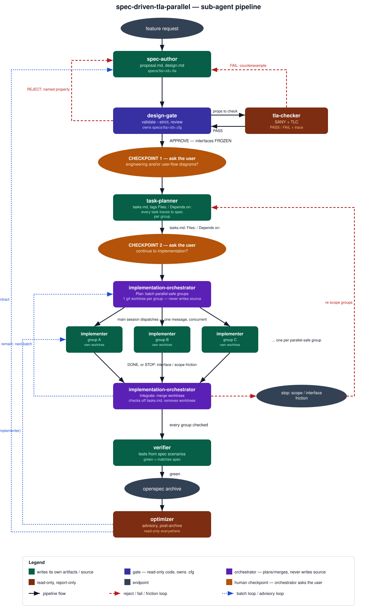

# spec-driven-tla-parallel

Skill: [`skills/spec-driven-tla-parallel`](../skills/spec-driven-tla-parallel).
A fork of [spec-driven-tla](spec-driven-tla.md) that fans implementation out
across multiple concurrent implementer agents instead of one.

Eight role-scoped sub-agents carry one OpenSpec change from request to
archive. The main session is the **orchestrator**: it routes work between
agents, enforces phase gates, never writes specs or code itself, and is the
only agent that dispatches other agents — the `implementation-orchestrator`
plans and integrates, but the main session fires the parallel `implementer`
calls itself.

## What is different from spec-driven-tla

- **task-planner** tags every group in `tasks.md` with a `Files:` list and a
  `Depends on:` list, so groups can be checked for parallel safety.
- **implementation-orchestrator** (new) turns those tags into batches of
  parallel-safe groups, assigns one git worktree per group, and — after the
  main session runs the implementer agents — merges the finished worktrees
  back and updates `tasks.md`.
- **implementer** implements exactly one group, inside the worktree it was
  assigned, scoped to that group's declared files. Touching a file outside
  that scope is a stop condition, the same tier as interface friction.

## Pipeline diagram

Color key: green = writes its own artifacts or source, indigo = the gate
(read-only code, owns `.cfg`), violet = the implementation-orchestrator
(plans and merges, never writes source), brown = read-only report-only
agents, gray = pipeline endpoints. Solid black = pipeline flow, dashed red =
reject / fail / friction loop, dashed blue = batch loop or advisory loop.

## Agent roles and write boundaries

| Agent | Writes | Reads | Never touches |
|---|---|---|---|
| `spec-author` | `openspec/changes/<id>/{proposal,design,specs/*}.md`, `specs/tla/<id>.tla` | existing specs | source, tests |
| `design-gate` | `specs/tla/<id>.cfg` only | everything | proposal.md, design.md, `.tla`, source |
| `tla-checker` | nothing | `.tla`, `.cfg` | anything (report-only) |
| `task-planner` | `tasks.md`, tagged `Files:` / `Depends on:` per group | proposal, spec deltas, design.md | design.md, `.tla`/`.cfg`, source |
| `implementation-orchestrator` | `execution-plan.md`, `tasks.md` checkboxes | `tasks.md`, git state | source, tests, design.md, `.tla`/`.cfg` |
| `implementer` | source, inside its assigned worktree, within its group's `Files:` | design.md, its group's section of `tasks.md` | design.md, `specs/tla/*`, interface files, files outside its `Files:` list |
| `verifier` | `tests/*` | spec scenarios, design.md (not the implementation) | source, design.md, `.tla`/`.cfg` |
| `optimizer` | nothing | archived change, code | anything (report-only) |

## The three hard rules

1. **Frozen interfaces.** Once `design-gate` approves, every signature, error
   contract, and spec scenario in `design.md` is FROZEN. No downstream agent
   may alter one in place. A needed change goes through a **new** OpenSpec
   proposal. No exceptions.
2. **Revise loop.** A `design-gate` REJECT names a violated property; the
   `tla-checker` re-runs TLC on the revised model, returning either a
   **counterexample** (the `spec-author` revises the `.tla` model) or
   **evidence the objection does not hold** (returned to the gate). The gate
   re-reviews only models that PASS.
3. **Declared scope.** An `implementer` touches only the files its group
   declares in `tasks.md`. Needing another file is scope friction: it stops
   and reports, the task planner re-scopes the groups, and the batch
   re-runs. No implementer widens its own scope mid-batch.

## Human checkpoints

Only the orchestrator talks to the user — no sub-agent asks a question,
including `implementation-orchestrator`. It pauses at two points and waits
for a reply before dispatching the next agent; it never assumes an answer.

1. **Diagrams checkpoint** — right after `design-gate` approves and
   interfaces FREEZE, before dispatching `task-planner`. Offers to dispatch
   [`opsx_show_design`](opsx_show_design.md) for `<change-id>`, which draws
   an architecture, sequence, or flow diagram from `design.md` and the TLA+
   model.
2. **Implementation checkpoint** — right after `task-planner` writes
   `tasks.md`, before dispatching `implementation-orchestrator`'s first
   **Plan**. On no, the pipeline stops before any worktree is created;
   `tasks.md` is saved and the user resumes it explicitly later.

## The batch loop

`task-planner` writes `tasks.md` once. From there, `implementation-orchestrator`
alternates two modes until every group is checked:

1. **Plan** — batch every group whose dependencies are done and whose
   `Files:` lists don't overlap with each other. Create one git worktree and
   branch per group. Report the batch.
2. The main session dispatches one `implementer` agent per group in the
   batch, in a single message, so they run concurrently.
3. **Integrate** — merge each finished worktree's branch into the change's
   integration branch, check off `tasks.md`, remove the worktree. A merge
   conflict means the `Files:` scopes were wrong: stop, and send the
   conflicting groups back to the task planner to re-scope. A group that
   stopped on interface or scope friction is left unmerged and unchecked.
4. Repeat from Plan for the next batch, until every group is checked, then
   hand off to the verifier.

## Why parallel implementation is safe here

Interfaces are already FROZEN before any implementer runs — that's what
makes concurrent implementation safe in the first place, not an added
safeguard. The only new failure mode parallel work introduces is a **file
race**: two implementers editing the same file at once. `task-planner`'s
`Files:` tags and `implementation-orchestrator`'s batching close that gap
before it opens — a batch never contains two groups with overlapping files,
and each group works in its own git worktree, so no two implementers ever
share a working directory.

## Documentation style: ASD-STE100

`spec-author`, `task-planner`, `implementation-orchestrator`, `optimizer`,
and `design-gate`'s verdicts write their Markdown in ASD-STE100 Simplified
Technical English — one instruction per sentence, active voice, one word per
meaning. The rule is built into each agent's prompt. Code, identifiers, and
quoted error or trace text stay exact; STE governs prose only.

## See also

- [spec-driven-tla](spec-driven-tla.md) — the single-implementer version this
  forks from.
- [opsx_show_design](opsx_show_design.md) — draws the diagrams the
  Checkpoint 1 offers.
- [TLA+](tla-plus.md) — what it models, TLC, why bounds matter.
- [OpenSpec](openspec.md) — phases, workspace layout, key commands.
- [`skills/spec-driven-tla-parallel`](../skills/spec-driven-tla-parallel) —
  the installable skill and its agent templates.
